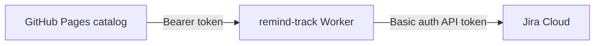

# Deploy to GitHub Pages

## One-time setup

### 1. Create the GitHub repo

1. Open https://github.com/new
2. Repository name: `lf-confluence-catalog` (or pick another name — see note below)
3. **Private** or **Public** (team must have repo access if private)
4. Do **not** add README / .gitignore (we already have them)
5. Create repository

### 2. Push this project

```bash
cd ~/Projects/lf-confluence-catalog

git add .
git commit -m "Initial commit: LF Confluence catalog with GitHub Pages"
git branch -M main
git remote add origin https://github.com/YOUR_ORG_OR_USER/lf-confluence-catalog.git
git push -u origin main
```

Replace `YOUR_ORG_OR_USER` with your GitHub username or org.

### 3. Enable GitHub Pages

1. Repo → **Settings** → **Pages**
2. **Build and deployment** → Source: **GitHub Actions**
3. After the first push, open **Actions** tab — wait for **Deploy to GitHub Pages** to finish (green)

### 4. Open the site

```
https://YOUR_ORG_OR_USER.github.io/lf-confluence-catalog/
```

Share that URL with your team.

---

## Custom domain (for Okta / Cloudflare Access)

Use a LotusFlare hostname so IT can put **Cloudflare Access + Okta** in front of the site.  
Default hostname for IT: **`confluence-catalog.lotusflare.com`** (add `public/CNAME` when DNS is ready).

> **Important:** Only enable the custom domain in GitHub **after** IT confirms DNS resolves.  
> If you enable it too early, `github.io` will redirect to a dead hostname and the site becomes unreachable.

### 1. DNS (ask IT / Infra)

Create a **CNAME** record:

| Type | Name | Target |
|------|------|--------|
| CNAME | `confluence-catalog` (or your chosen host) | `chenpan-star.github.io` |

If you use a different hostname, edit `public/CNAME` to match exactly (one line, no `https://`).

### 2. GitHub Pages settings

1. Repo → **Settings** → **Pages**
2. Under **Custom domain**, enter the same hostname as `public/CNAME`  
   (e.g. `confluence-catalog.lotusflare.com`) → **Save**
3. Wait for DNS check (can take up to 24h; often minutes)
4. Enable **Enforce HTTPS** once the certificate is ready

The `public/CNAME` file (when present) is copied into `dist/` on each deploy so GitHub keeps the domain configured.  
Create `public/CNAME` with one line — the hostname only — when DNS is live.

### 3. Actions variable (required for custom domain)

Project sites on `github.io` use base path `/lf-confluence-catalog/`.  
A custom domain serves the site at the **domain root**, so assets must use `/`.

1. Repo → **Settings** → **Secrets and variables** → **Actions** → **Variables**
2. **New repository variable**
   - Name: `VITE_BASE_PATH`
   - Value: `/`
3. Re-run **Deploy to GitHub Pages** (or push a commit)

Until this variable is set, the custom domain may load but CSS/JS routes can 404.

### 4. Verify

```bash
curl -sI https://confluence-catalog.lotusflare.com/ | head -3
curl -sI https://confluence-catalog.lotusflare.com/data/catalog.json | head -3
```

Open the site in a browser and check category navigation works.

### 5. Restrict access to LotusFlare employees (Okta + Cloudflare)

GitHub Pages **cannot** enforce login by itself. The `github.io` URL is public to anyone with the link.  
To allow **only LotusFlare staff**, IT puts **Cloudflare Access** in front of a **LotusFlare custom domain** with **Okta** as the identity provider.

```mermaid
flowchart LR
  User --> CF[Cloudflare Access]
  CF -->|Okta login| Okta[Okta]
  CF -->|@lotusflare.com allowed| GH[GitHub Pages origin]
```

#### What you need from IT (copy this ticket)

**Subject:** Cloudflare Access + Okta for `confluence-catalog.lotusflare.com`

**Request:**

1. **DNS** (Cloudflare-proxied CNAME):
   - Name: `confluence-catalog.lotusflare.com`
   - Target: `chenpan-star.github.io`
   - Proxy: **ON** (orange cloud) — required for Access

2. **Cloudflare Zero Trust → Access → Application**
   - Type: Self-hosted
   - Domain: `confluence-catalog.lotusflare.com`
   - Session: 24h (or company default)

3. **Access policy**
   - Allow: emails ending in `@lotusflare.com` **OR** Okta group (e.g. all employees)
   - Deny: everyone else

4. **Identity provider:** Okta (SAML or OIDC — use existing LotusFlare Okta ↔ Cloudflare integration if present)

5. **Confirm** when DNS resolves:
   ```bash
   dig +short confluence-catalog.lotusflare.com
   ```

**Context:** Static internal Confluence catalog on GitHub Pages; contains page titles/URLs/metadata. Origin repo: `chenpan-star/lf-confluence-catalog`.

#### After IT confirms DNS + Access

Do these in order:

| Step | Action |
|------|--------|
| 1 | IT confirms `dig confluence-catalog.lotusflare.com` returns Cloudflare IPs |
| 2 | Create `public/CNAME` with one line: `confluence-catalog.lotusflare.com` |
| 3 | Commit + push → wait for deploy |
| 4 | GitHub → **Settings → Pages** → Custom domain → `confluence-catalog.lotusflare.com` |
| 5 | **Repository variable** `VITE_BASE_PATH` = `/` |
| 6 | Re-run **Deploy to GitHub Pages** |
| 7 | Open `https://confluence-catalog.lotusflare.com` → should redirect to **Okta login** |
| 8 | Share **only** the custom domain URL internally (not `github.io`) |

#### Important limitations

| URL | Protected? |
|-----|------------|
| `https://confluence-catalog.lotusflare.com` | **Yes** (after Cloudflare Access) |
| `https://chenpan-star.github.io/lf-confluence-catalog/` | **No** — still public; do not share |

To reduce leakage: stop sharing the `github.io` link; optionally ask IT if the origin can be blocked (Cloudflare cannot protect `*.github.io`).

#### Verify access works

```bash
# Without login — should NOT return catalog HTML (Access block or redirect)
curl -sI https://confluence-catalog.lotusflare.com/data/catalog.json | head -5
```

In a browser (logged out): opening the URL should show **Cloudflare/Okta login**, not the catalog.

---

## Daily Confluence refresh (optional)

1. Repo → **Settings** → **Secrets and variables** → **Actions**
2. Add secrets:
   - `ATLASSIAN_EMAIL`
   - `ATLASSIAN_API_TOKEN`
3. Workflow **Refresh Confluence catalog** runs daily at 06:00 UTC

Or run manually: **Actions** → **Refresh Confluence catalog** → **Run workflow**

After refresh commits new `catalog.json`, push triggers **Deploy to GitHub Pages** automatically.

---

## Slack reminders (copy & open)

**Send reminder** on the catalog copies a message and opens Slack so you can paste it into the last editor’s DM.

Optional: **Jira tracking** — when the remind-track Worker is configured, each **Copy & open Slack** also creates a Jira task (one per message part). See [Jira remind tracking](#jira-remind-tracking-server-side) below.

### Slack user ID map (optional)

Improves **Copy & open Slack** deep-links (maps Confluence names / emails → Slack member IDs). **Required for auto Slack DMs** via the remind Worker.

1. Slack app → **OAuth & Permissions** → add Bot scopes:
   - **`users:read`** (user map export)
   - **`users:read.email`** (Worker resolves Slack members by email when `slack.json` ids are stale)
   - **`im:history`** and **`channels:read`** (Worker verifies DMs landed in the recipient’s bot thread; without these, UI shows “accepted” not “verified”)
   - **`chat:write`**, **`im:write`** (bot DMs via remind Worker)
   → **Reinstall to workspace**
2. Put token in `.env` (never commit):
   ```env
   SLACK_BOT_TOKEN=xoxb-…
   ```
3. Export:
   ```bash
   npm run slack:export-users              # writes data/slack-users-export.json
   npm run slack:export-users -- --apply   # also merges into public/config/slack.json
   ```
4. Commit `public/config/slack.json` if you want the map on the live site.

**Monthly GitHub Action:** workflow `Refresh Slack user map` runs on the 1st of each month (and via **Actions → Run workflow**).

1. Repo **Settings → Secrets and variables → Actions** → secret **`SLACK_BOT_TOKEN`** (`xoxb-…`, scope `users:read`)
2. First run: **Actions → Refresh Slack user map → Run workflow**
3. On change it commits `public/config/slack.json`; push to `main` triggers Pages deploy

**Auto Slack DMs:** the same **`SLACK_BOT_TOKEN`** must be on the remind Worker (GitHub secret → **Deploy remind-track Worker** syncs it). Bot posts `chat.postMessage` to the member id from `slack.json`.

---

## Jira remind tracking (server-side)

When enabled, **Copy & open Slack** also **`POST`s to a Cloudflare Worker**, which creates a Jira issue via the REST API (same text as the Slack message, assignee matched when possible).

### Architecture



The catalog stays static; **Jira credentials live only on the Worker**. The browser holds a shared **`VITE_REMIND_API_KEY`** (same value as Worker secret **`REMIND_API_SECRET`**) — treat the site as internal (Cloudflare Access + Okta) so only staff can use the UI.

### 1. Configure the Worker

1. Edit `worker/remind-track/wrangler.jsonc`:
   - Set **`JIRA_PROJECT_KEY`** (and optionally `JIRA_ISSUE_TYPE`, **`JIRA_PRIORITY_NAME`** (default `Major`), `JIRA_LABELS`).
   - **PROT** requires **Requested Due Date** — the Worker fills required date fields automatically (**today + 14 working days**, Mon–Fri; override with **`JIRA_DUE_DATE_WORKING_DAYS`**, **`JIRA_DUE_DATE_TIMEZONE`**, or **`JIRA_REQUESTED_DUE_DATE_FIELD`**).
   - **Start date** fields (name contains “start”) default to **today** in **`JIRA_DUE_DATE_TIMEZONE`** (override with **`JIRA_START_DATE_FIELD`**).
   - After create, the Worker queues a **Jira email** to the assignee (or editor’s Jira account) via `POST /issue/{key}/notify` — disable with **`JIRA_NOTIFY_ASSIGNEE=false`**. Uses Atlassian’s mail queue (same as manual “Send email” in Jira).
   - Add your Cloudflare **`account_id`** if `wrangler deploy` asks for it.
   - Prefer a **custom domain route** on `*.lotusflare.com` if `*.workers.dev` is blocked on office DNS.

2. Local secrets — copy `worker/remind-track/.dev.vars.example` → `.dev.vars` (gitignored).

### Option B — GitHub Actions (recommended)

```bash
cd ~/Projects/lf-confluence-catalog
gh auth login
export CLOUDFLARE_API_TOKEN='…'
export CLOUDFLARE_ACCOUNT_ID='…'
./scripts/setup-remind-worker-github.sh
gh workflow run deploy-remind-worker.yml -R chenpan-star/lf-confluence-catalog
```

The script uses **Atlassian** values from your `.env`, generates **`REMIND_API_SECRET`**, and sets GitHub secrets (including **`VITE_REMIND_API_KEY`**). After the workflow run, open **Summary** → copy **Worker URL** → `gh variable set VITE_REMIND_TRACK_URL --body '<url>' -R chenpan-star/lf-confluence-catalog`, then redeploy Pages.

### Option A — Deploy from your laptop

3. Deploy:
   ```bash
   npm ci
   npx wrangler secret put REMIND_API_SECRET --config worker/remind-track/wrangler.jsonc
   npx wrangler secret put ATLASSIAN_EMAIL --config worker/remind-track/wrangler.jsonc
   npx wrangler secret put ATLASSIAN_API_TOKEN --config worker/remind-track/wrangler.jsonc
   npm run worker:remind:deploy
   ```

4. Health check: `curl -s https://<worker-host>/health`

### 2. Wire the catalog build

GitHub **Actions → Variables / Secrets**:

| Name | Type | Value |
|------|------|--------|
| `VITE_REMIND_TRACK_URL` | Variable | Worker base URL, e.g. `https://lf-catalog-remind-track.<subdomain>.workers.dev` |
| `VITE_REMIND_API_KEY` | Secret | Same random string as `REMIND_API_SECRET` |

Local `.env`:

```env
VITE_REMIND_TRACK_URL=http://localhost:8787
VITE_REMIND_API_KEY=<same as REMIND_API_SECRET in .dev.vars>
```

Run `npm run worker:remind:dev` in one terminal and `npm run dev` in another to test.

### 3. Issue behavior

- **One Jira issue per Copy & open Slack click** (each multi-part message gets its own issue).
- **Summary:** `[Confluence review] {editor} (part X/Y) — N outdated pages`
- **Assignee:** Jira user search by editor email / name in the configured project.
- **Labels:** from `public/config/remind-track.json` (defaults: `confluence-catalog`, `doc-review`).

If Jira fails, Slack copy still succeeds; the modal shows a warning with the error.

### 4. Cannot open `*.workers.dev` (office DNS)

The Worker can be **healthy** (GitHub Actions / Cloudflare dashboard) while your **browser or office network blocks** `https://….workers.dev` — same as before with other Workers.

- You **do not** need to open the Worker URL in a browser for day-to-day use; the **catalog** calls it when you click **Copy & open Slack**.
- If that call is blocked too, Jira tracking will fail on office Wi‑Fi with a timeout — Slack copy still works.

**Fix (recommended for LotusFlare):** put the Worker on a **company hostname** on Cloudflare, e.g. `confluence-catalog-remind.lotusflare.com`:

1. Ensure **`lotusflare.com`** is on the **same Cloudflare account** as the Worker (or ask Infra).
2. In `worker/remind-track/wrangler.jsonc`, add (example):

   ```jsonc
   "routes": [
     {
       "pattern": "confluence-catalog-remind.lotusflare.com",
       "custom_domain": true
     }
   ]
   ```

3. Redeploy the Worker (`Deploy remind-track Worker` workflow). Cloudflare creates DNS for the custom domain when the zone is on that account.
4. Add that hostname to `ALLOWED_ORIGINS` in the same file (comma-separated).
5. Update GitHub variable **`VITE_REMIND_TRACK_URL`** to `https://confluence-catalog-remind.lotusflare.com` and redeploy Pages.

**Quick test:** phone on cellular → open `…/health` — if it loads, the Worker is fine and the block is corporate DNS only.

**Dashboard check:** Cloudflare → **Workers & Pages** → **lf-catalog-remind-track** → metrics / **Visit** (may work from Cloudflare UI even when `workers.dev` is blocked locally).

---

## If you use a different repo name

The build sets `VITE_BASE_PATH` from the repo name automatically.  
Your site URL will be:

```
https://<user>.github.io/<repo-name>/
```

---

## Local vs GitHub Pages

| | Local `npm run dev` | GitHub Pages |
|--|---------------------|--------------|
| URL | http://localhost:5174/ | https://….github.io/lf-confluence-catalog/ |
| Who sees it | Only you | Anyone with the link (or repo access) |
| Data refresh | `npm run refresh` on your Mac | GitHub Action + secrets |
