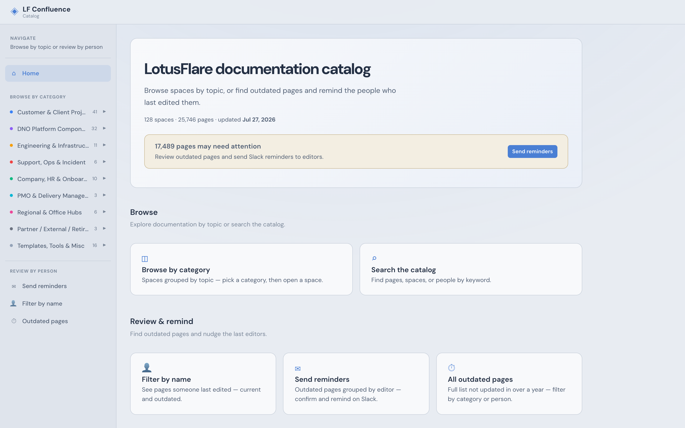
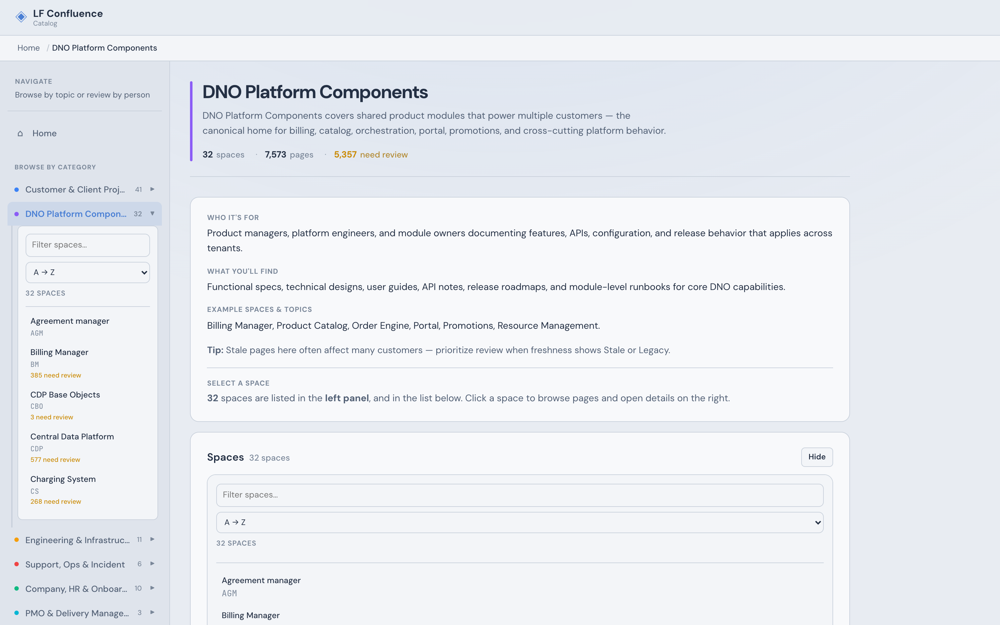
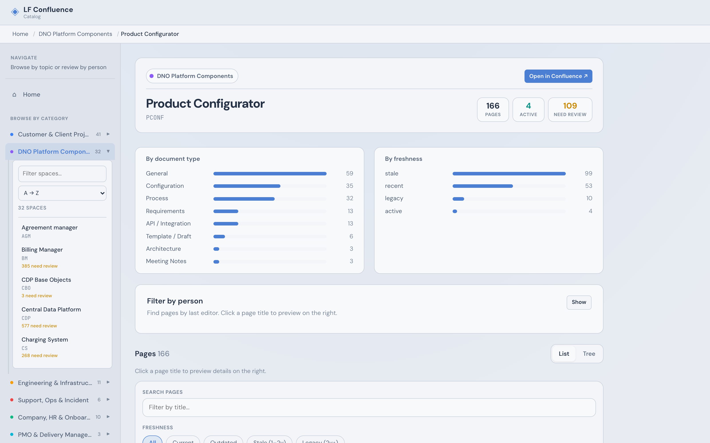
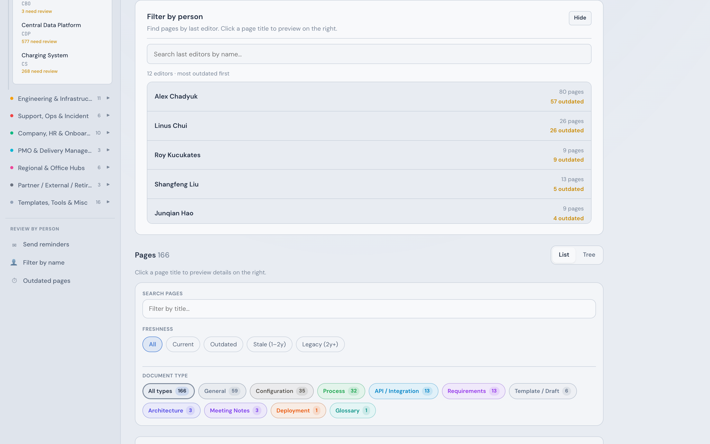
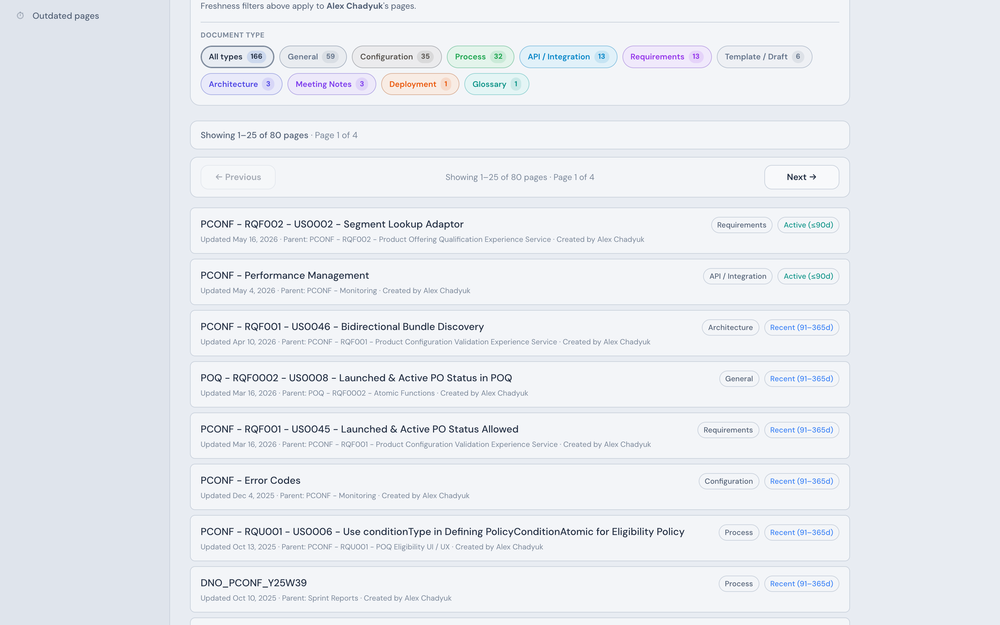
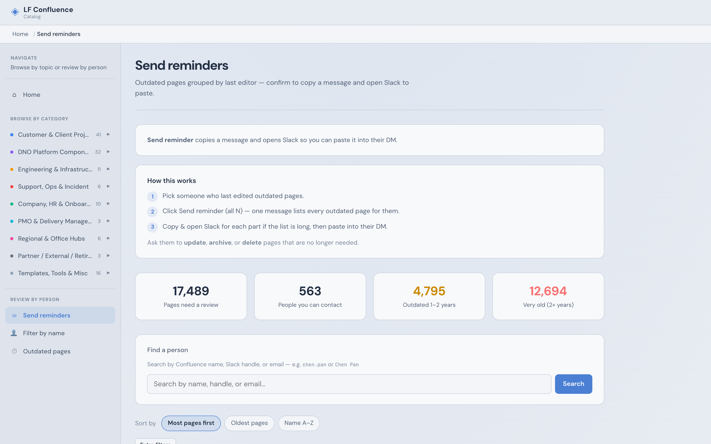
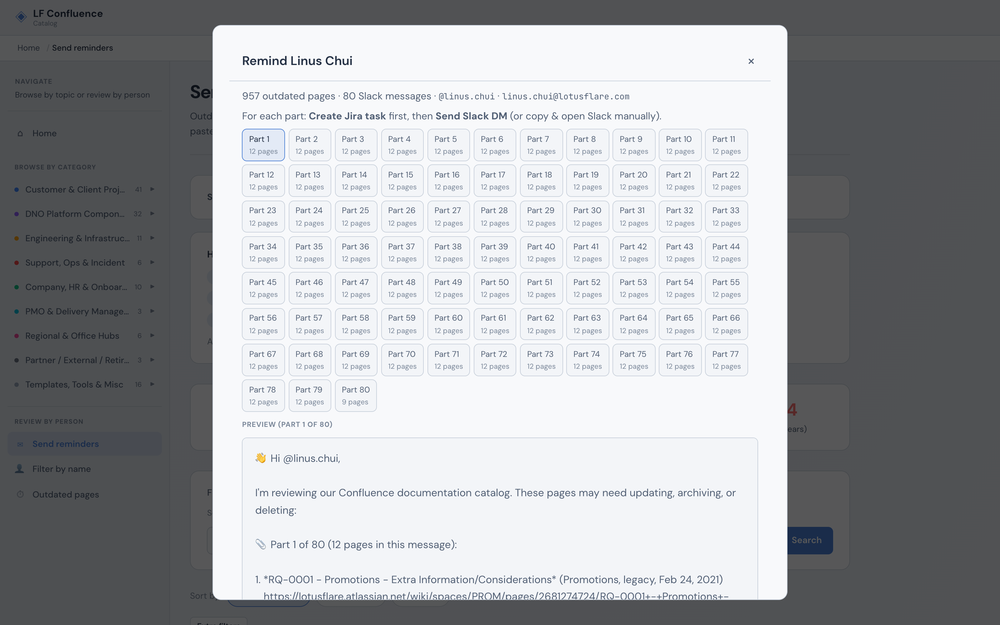

# LF Confluence Catalog — User guide

How to use the **LF Confluence Catalog** website: browse Confluence documentation metadata, find outdated pages, and remind people who last edited them. This guide covers **only what you do in the browser** — buttons, screens, and messages.

Screenshots below use the catalog’s **soft** theme and sample spaces from a recent snapshot. If you view this file on the live site, the same images are at `/onboarding/01-home.png` … `/onboarding/07-remind-modal.png` (with your site’s base path prefix if any).

---

## Table of contents

1. [What this site is](#1-what-this-site-is)
2. [Opening the catalog](#2-opening-the-catalog)
3. [How fresh the data is](#3-how-fresh-the-data-is)
4. [Page freshness labels](#4-page-freshness-labels)
5. [Layout and navigation](#5-layout-and-navigation)
6. [Browse documentation](#6-browse-documentation)
7. [Find outdated pages](#7-find-outdated-pages)
8. [Send reminders (step by step)](#8-send-reminders-step-by-step)
9. [Remind from a single page](#9-remind-from-a-single-page)
10. [What you see in Jira](#10-what-you-see-in-jira)
11. [What you see in Slack](#11-what-you-see-in-slack)
12. [Email and extra actions](#12-email-and-extra-actions)
13. [If you receive a reminder](#13-if-you-receive-a-reminder)
14. [Common questions](#14-common-questions)
15. [Quick reference](#15-quick-reference)

---

## 1. What this site is

**LF Confluence Catalog** is a **read-only** view of documentation on **lotusflare.atlassian.net**:

- Spaces and pages with **title**, **last modified**, **creator**, **last editor**, **type**, and **freshness**.
- Links to open the **real page in Confluence** — you never edit content inside the catalog.

**Three main things you can do:**

| Goal | Start here |
|------|------------|
| Explore docs by topic | **Home** → **Browse by category** |
| Find something specific | **Search the catalog** |
| Nudge owners of old docs | **Send reminders** |

Some teams also see **Create Jira task** and **Send Slack DM** in the remind flow. If you only see **Copy & open Slack**, you can still copy the message and paste it in Slack yourself.

---

## 2. Opening the catalog

Use the URL your team shared (for example a `github.io` link or **confluence-catalog.lotusflare.com**).

- You may need to sign in with **Okta** or enter a **team password** first.
- After that, you land on **Home** with space/page counts and an **updated** date.



---

## 3. How fresh the data is

On **Home**, note the line **updated &lt;date&gt;** — that is when the catalog snapshot was last refreshed (usually about **once per day**).

- Edits in Confluence from **today** might not appear until the next refresh.
- For live content and permissions, always use **Read full page in Confluence**.

Personal Confluence spaces are not listed in the catalog.

---

## 4. Page freshness labels

Each page has a freshness badge based on **last modified**:

| Label | Rough age |
|-------|-----------|
| **Active** | Updated in the last **90 days** |
| **Recent** | **91 days – 1 year** |
| **Stale** | **1–2 years** |
| **Legacy** | **Over 2 years** |

**Outdated** in remind flows means **stale** or **legacy** (older than about **one year**). Those are the pages the app suggests you ask someone to review.

---

## 5. Layout and navigation

### Top bar

- **LF Confluence Catalog** logo → **Home**
- **☰** opens the sidebar (important on mobile)

### Sidebar

| Item | Use it to… |
|------|------------|
| **Home** | Overview and shortcuts |
| **Send reminders** | See outdated pages **by last editor** and send nudges |
| **Filter by name** | Find pages linked to a **person** |
| **Outdated pages** | Full list of old pages with filters |
| **Categories** | Open a topic, then a **space** |
| **All spaces** | List every space |

### While you browse

- **Context bar** — breadcrumbs (where you are).
- **Page panel** — click many page titles to see details on the right; **Read in Confluence** opens Atlassian; **×** closes the panel.
- **Theme** — if shown in the sidebar, switch light/dark for comfort.

---

## 6. Browse documentation

### By category

1. From **Home**, choose **Browse by category** (or expand a category in the sidebar).
2. Open a **space**.
3. Scroll or filter the page list.
4. Open a page → side panel → **Read full page in Confluence**.





### All spaces

**Browse all spaces** (linked from Home) shows every space with counts and freshness summaries.

### Search

1. Open **Search the catalog**.
2. Type keywords (page title, space name, editor name, etc.).
3. Open a result under **Spaces** or **Pages**.

Search uses the catalog snapshot, not Confluence’s own search.

---

## 7. Find outdated pages

### Outdated pages

Lists all **stale** and **legacy** pages. Use filters (category, space, recency, search) to narrow the list. Good for audits by space or topic.

### Filter by name

Search for a **person** (name, or handle like `firstname.lastname`). You see pages where they are **last editor** — including pages that are still “active” if you need full context.

On a **space** page you can also open **Filter by person** to see editors in that space, then narrow to one person’s pages:





### Send reminders (main hygiene screen)

- One **card per person** who is last editor on at least one outdated page.
- Shows **how many** outdated pages and optional **Slack @handle**.
- **Send reminder (all N)** opens the remind dialog for that person.

**On this screen you can:**

- Search editors by name or handle.
- Filter by space, recency, or page title; change sort order.
- Turn off **automated accounts** (bots) — they usually should not get Slack nudges.
- Move through **pages of results** if the list is long.



---

## 8. Send reminders (step by step)

### 1. Open the screen

Sidebar → **Send reminders** (or Home → **Send reminders** under **Review & remind**).

Read the **banner** at the top — it tells you whether **Jira** and **Send Slack DM** are available, or **Copy & open Slack** only.

### 2. Choose a person

Find their card and click **Send reminder (all N)**.

- **Automated accounts:** the remind button is disabled; handle those pages another way.

### 3. Use the remind dialog

You will see:

- **Who** you are reminding and any **@handle** or email hint shown by the app.
- **How many pages** and a **Preview** of the message.
- **Part tabs** if there are more than **12 pages** — each part is a separate message (Part 1, Part 2, …).

Switch **Part** tabs before you act on each chunk.



### 4. Create Jira task (when the button appears)

For the **selected part**:

1. Click **Create Jira task** (this is the first action; it is highlighted until done).
2. Wait until the button shows **Jira PROT-… ✓** and the part tab shows the ticket key.
3. In Jira (open the link from the ticket key if you want), the assignee should see the page list and a **Due date** about **two weeks** out.

**Notes:**

- Click **Create Jira** once per part — if it already shows **✓**, do not click again.
- If you closed the dialog and come back later, the app may show **✓** again after a moment if that part already has a ticket.

### 5. Send Slack DM (when the button is enabled)

1. Only after **Jira PROT-… ✓** for that part, **Send Slack DM** becomes clickable.
2. Click it and wait for success text in the dialog (or an error you can read).
3. The recipient should get a DM with page links and the **Jira task** link.

If **Send Slack DM** stays gray, use **Copy & open Slack** instead.

### 6. Copy & open Slack (always available when remind is open)

- Copies the **Preview** text.
- Opens Slack so you can paste into the person’s DM.

Works even when Jira/Slack buttons are unavailable. If Jira was created for that part, the copied text should include the task reference when the app has filled it in.

### 7. More options (when expanded)

- **Copy preview only** — clipboard without opening Slack.
- **Email (this part)** — opens your mail app with a draft to paste/send.

### 8. Finish

Repeat **Create Jira** → **Send Slack DM** (or copy) for **each Part** tab, then **Done** or close the dialog.

### Buttons you might see

| What you see | What to do |
|--------------|------------|
| **Create Jira task** gray with “already created” | Use **Send Slack** or switch part |
| **Send Slack DM** gray | **Create Jira** for this part first |
| Error under the preview | Read the message; try **Copy & open Slack** |
| **Creating…** / **Sending…** | Wait until the button finishes |

---

## 9. Remind from a single page

On a **space** view, outdated rows may have **Send reminder**.

Same dialog as above, usually **one part** only:

1. **Create Jira task**
2. **Send Slack DM** (if enabled)
3. Or **Copy & open Slack**

Use **Send reminders** when one person has **many** outdated pages at once.

---

## 10. What you see in Jira

After **Create Jira task**, open the issue in Jira (from the key on the button or tab):

- **Project** is usually **PROT**, type **Task**.
- **Summary** mentions Confluence review, the editor name, part **X/Y**, and page count.
- **Assignee** should be the page owner when Jira can match their account.
- **Due date** — the standard **Due date** field on the issue (about **14 days** from when you created the task).
- **Description** — greeting and a **list of Confluence links** to review.

You can reassign or edit dates in Jira like any other task. The catalog does not update Jira after you change things there.

**Email:** You might get Jira mail or only an in-app notification — that depends on your **Jira profile notification settings**, not the catalog.

---

## 11. What you see in Slack

### Send Slack DM

- A DM from the **LF Confluence Catalog** bot (if your org uses it).
- Short greeting, numbered pages with links, and **Jira** key/link when Jira was created first.

### Copy & open Slack

- You paste the same style of message yourself.
- Slack may open directly to a DM or to the workspace — find the person if needed.

One **Send Slack DM** (or one paste) per **Part** tab.

---

## 12. Email and extra actions

Inside the remind dialog, **More options** may offer:

- **Copy preview only**
- **Email (this part)** — uses your local mail client

Use these when Slack or Jira buttons are not enough for your workflow.

---

## 13. If you receive a reminder

Someone used the catalog to ask you to review pages:

1. Open each **Confluence link** (from Slack and/or Jira).
2. **Update**, **archive**, or **delete** pages per team policy.
3. Close or comment on the **PROT** task in Jira when finished.

You do not need to use the catalog to complete the work — only Confluence and Jira.

---

## 14. Common questions

**The home “updated” date is old.**  
The snapshot refreshes on a schedule. Use Confluence for today’s edits.

**I only see Copy & open Slack.**  
Your catalog view may not have integrated Jira/Slack actions — manual copy still works.

**Send Slack DM is disabled.**  
Create **Jira** for that **part** first and wait for **PROT-… ✓**.

**I created Jira but Due date is empty on an old ticket.**  
Create a **new** remind for a test, or set **Due date** manually in Jira. Only new creates from the catalog set dates automatically.

**Wrong person on the Jira task or Slack.**  
The app uses Confluence **last editor** name. Reassign in Jira; fix the editor in Confluence for next time.

**Too many PROT tickets.**  
Use one remind dialog per person; the app tries not to duplicate an **open** task for the same part when you use **Create Jira** again.

**Message split into Part 1, 2, 3.**  
More than **12 pages** — handle each part’s Jira and Slack separately.

**Bot / automated editor on the list.**  
Hide automated accounts on **Send reminders**; those cards cannot be reminded from the app.

---

## 15. Quick reference

```text
Send reminders
  → pick person → Send reminder (all N)
  → [Part tab if needed]
  → Create Jira task     → wait for PROT-… ✓
  → Send Slack DM        → (or Copy & open Slack)
  → next Part → Done
```

**Browse path:** Home → Category → Space → page → **Read in Confluence**

**Hygiene path:** Home → **Send reminders** → editor → Jira then Slack (or copy)

---

*For deployment, integrations, and admin setup, see internal maintainer documentation — not required for day-to-day catalog use.*
